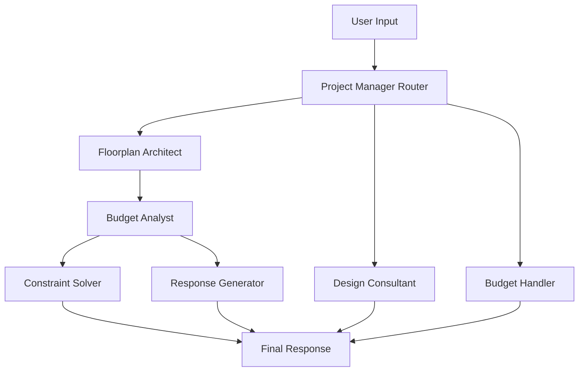

# 🏠 House Design Agent: AI-Powered Architectural Assistant

## Table of Contents
- [Overview](#overview)
- [Development Thinking Process](#development-thinking-process)
- [Core Ideas & Innovation](#core-ideas--innovation)
- [Technical Architecture](#technical-architecture)
- [Key Features](#key-features)
- [Technology Stack](#technology-stack)
- [System Workflow](#system-workflow)
- [Real-World Applications](#real-world-applications)
- [Future Enhancements](#future-enhancements)

---

## Overview

The **House Design Agent** is an intelligent AI-powered system that revolutionizes residential architectural planning through natural language interaction. Built using cutting-edge multi-agent architecture, it enables users to design houses, manage budgets, and solve architectural constraints through simple conversation.

**What makes it special?**
- 🤖 **Multi-Agent Intelligence**: Specialized AI agents for different aspects of home design
- 💬 **Natural Language Interface**: Design houses through conversation, not complex software
- 💰 **Real-Time Budget Analysis**: Instant cost calculations with Montreal construction standards
- 🏗️ **Constraint Solving**: Automatic solutions when designs exceed budget
- 🎨 **Professional Output**: Architectural-grade floorplan summaries and cost breakdowns

---

## Development Thinking Process

### 🎯 **Problem Identification**

**Traditional architectural design challenges:**
1. **Complexity Barrier**: CAD software requires extensive training
2. **Budget Disconnection**: Design decisions made without real-time cost feedback
3. **Iterative Friction**: Changes require manual recalculation and re-drawing
4. **Expert Dependency**: Need professional architects for basic layout decisions
5. **Communication Gap**: Technical drawings don't translate to client understanding

### 💡 **Vision & Solution Approach**

**Core Vision:** *"What if anyone could design a house by simply talking to an AI architect?"*

**Solution Philosophy:**
```
Natural Language → AI Understanding → Professional Results
    ↓                    ↓                     ↓
"Add a master      →  Intelligent      →  Architectural 
bedroom 14x16"        Processing           Drawings
```

### 🧠 **Architectural Thinking Process**

**1. Multi-Agent Design Pattern**
- **Why?** Different aspects of home design require specialized expertise
- **How?** Create specialized AI agents that excel in specific domains
- **Result:** More accurate, contextual responses than a single general-purpose AI

**2. State-Driven Workflow**
- **Why?** House design is iterative - each change affects everything else
- **How?** Maintain persistent state across all interactions
- **Result:** Consistent, cumulative design process

**3. Real-Time Feedback Loops**
- **Why?** Design decisions should be informed by immediate cost impact
- **How?** Automatic budget recalculation after every change
- **Result:** Budget-conscious design from the start

---

## Core Ideas & Innovation

### 🚀 **Revolutionary Concepts**

#### 1. **Conversational Architecture**
```
Traditional: Learn CAD → Draw → Calculate → Revise
Our Approach: Talk → AI Designs → Instant Feedback → Iterate
```

**Innovation:** Natural language becomes the primary interface for architectural design.

#### 2. **Intelligent Agent Orchestration**
```
User Request → Project Manager → Specialized Agent → Professional Output
      ↓              ↓                  ↓                    ↓
"Add office"  →  Route to        →  Floorplan        →  Updated layout
                 FloorplanAgent      Architect           + cost analysis
```

**Innovation:** AI agents collaborate like a real architectural firm.

#### 3. **Budget-Driven Design**
```
Every Design Change → Automatic Cost Calculation → Budget Status → Constraint Solving
```

**Innovation:** Financial constraints drive design decisions in real-time.

#### 4. **Constraint-Aware Problem Solving**
```
Over Budget → Analyze Floorplan → Generate Solutions → Present Options
     ↓              ↓                    ↓                  ↓
$50k over    →  Find largest      →  "Reduce garage   →  User chooses
               rooms/extras           saves $25k"          solution
```

**Innovation:** AI automatically generates practical cost-reduction strategies.

### 🎨 **Design Philosophy**

**User-Centric Principles:**
- **Accessibility**: No technical expertise required
- **Transparency**: Every decision explained with costs
- **Flexibility**: Easy to modify and iterate
- **Professional Quality**: Architectural-grade outputs

**AI-First Principles:**
- **Specialized Intelligence**: Each agent excels in its domain
- **Context Awareness**: Agents understand conversation history
- **Proactive Assistance**: System anticipates user needs
- **Continuous Learning**: Improved responses through interaction

---

## Technical Architecture

### 🏗️ **System Architecture Overview**



### 🤖 **Multi-Agent System Design**

#### **1. Project Manager Router**
```python
Role: Traffic Controller & Intent Classifier
Responsibilities:
- Analyze user input
- Extract budget information
- Route to appropriate specialist
- Classify intent: modify_floorplan | ask_question | set_budget
```

#### **2. Floorplan Architect Agent**
```python
Role: Spatial Design Specialist
Capabilities:
- Add/remove/modify rooms
- Handle complex requests (multiple rooms, floors)
- Apply architectural standards
- Generate reasonable room dimensions
```

#### **3. Budget Analyst Agent**
```python
Role: Financial Calculator
Functions:
- Calculate construction costs ($350/sq ft Montreal standard)
- Track total area and expenses
- Compare against user budget
- Trigger constraint solving when over budget
```

#### **4. Constraint Solver Agent**
```python
Role: Problem-Solving Consultant
Expertise:
- Analyze budget overruns
- Generate specific cost-reduction suggestions
- Prioritize design modifications
- Present practical alternatives
```

#### **5. Design Consultant Agent**
```python
Role: General Architecture Advisor
Knowledge Areas:
- Building materials and finishes
- Montreal/Quebec building codes
- Design styles and aesthetics
- Climate considerations
```

### 🔄 **State Management Architecture**

```python
class AppState(TypedDict):
    conversation_history: List[str]    # Complete dialogue context
    floorplan: List[Dict[str, Any]]   # Room data structures
    total_sqft: float                 # Calculated total area
    estimated_cost: Optional[float]   # Current cost estimate
    user_budget: Optional[float]      # User's budget limit
    final_response: str              # AI agent response
    last_message: str                # Current user input
    user_intent: str                 # Classified user intention
    next_action: str                 # Routing decision
```

**State Persistence:** Every interaction updates the global state, ensuring continuity and context awareness.

### ⚡ **LangGraph Workflow Engine**

**Why LangGraph?**
- **Orchestrates** complex multi-agent workflows
- **Manages** state transitions between agents
- **Provides** conditional routing logic
- **Ensures** reliable execution order

**Workflow Pattern:**
```python
Entry Point → Router → Specialist → [Budget Analysis] → [Constraint Solving] → Response
```

---

## Key Features

### 🎯 **Core Capabilities**

#### **1. Natural Language Floorplan Design**
```
User: "Add a three-floor house with 3 bedrooms, 2 bathrooms, office, and 2-car garage"
System: Creates complete architectural layout with:
- First Floor: Living room, kitchen, dining, guest bath, garage
- Second Floor: Master bedroom, master bath, bedroom 2, main bath  
- Third Floor: Bedroom 3, office
```

#### **2. Intelligent Room Management**
- **Add Rooms**: "Add a master bedroom 14x16 feet"
- **Modify Rooms**: "Make the kitchen bigger, change to 14x18"
- **Remove Rooms**: "Remove the third garage bay"
- **Multiple Operations**: "Add 2 more office rooms"

#### **3. Real-Time Budget Analysis**
```yaml
Automatic Calculations:
  - Cost per square foot: $350 (Montreal standard)
  - Total project cost: Real-time updates
  - Budget comparison: Over/under/within analysis
  - Savings opportunities: Constraint-based suggestions
```

#### **4. Professional Output Generation**
```
✅ **Draft Floorplan v1 (simulation)**
- Floors: 3
- Total area: 2,500 ft² (approx. 833 ft² per floor)
- Lot shape: 40' × 62' rectangle
- Rooms:
  - Living Room: 18' × 22'
  - Master Bedroom: 14' × 16'
  - Office: 12' × 14'
  [... complete room listing]

💰 **Budget Analysis:**
- Estimated cost: $875,000.00
- Your budget: $800,000.00
- Status: ⚠️ Over budget
- Over by: $75,000 (9.4%)
```

#### **5. Constraint-Aware Problem Solving**
When over budget, the system automatically:
- Identifies cost reduction opportunities
- Suggests specific modifications
- Quantifies savings for each option
- Maintains design integrity

### 🖥️ **User Interface Options**

#### **1. Web Interface (Gradio)**
- **Real-time chat** with AI agents
- **Live floorplan display** with automatic updates
- **Budget status indicators** with visual feedback
- **Cost breakdown panels** showing detailed analysis

#### **2. Command Line Interface**
- **Direct terminal interaction** for developers
- **Immediate responses** without browser overhead
- **Debugging capabilities** with verbose output
- **Scripting support** for automated testing

---

## Technology Stack

### 🧠 **AI & Machine Learning**

#### **Language Models**
```yaml
Primary LLM: OpenAI GPT-4
Temperature: 0.1 (deterministic responses)
Role: Multi-agent decision making and response generation

Capabilities:
  - Intent classification
  - JSON-structured responses  
  - Domain-specific knowledge
  - Natural language understanding
```

#### **LangChain Ecosystem**
```yaml
LangChain Core: Message handling and prompt management
LangChain-OpenAI: GPT-4 integration and API management
LangGraph: Multi-agent workflow orchestration
```

### 🔧 **Core Technologies**

#### **Backend Framework**
```python
Language: Python 3.8+
Architecture: Multi-agent state machine
Pattern: Event-driven workflow orchestration

Key Libraries:
- langgraph: Agent workflow management
- langchain: LLM integration and tooling
- typing-extensions: Type safety and validation
- python-dotenv: Environment configuration
```

#### **Data Processing**
```python
Tools Module: Custom architectural calculation functions
- Room geometry calculations
- Area summation algorithms
- Cost estimation formulas
- Floorplan formatting utilities

State Management:
- TypedDict: Type-safe state structure
- Immutable updates: Functional state transitions
- Persistent context: Conversation history tracking
```

#### **Frontend Technologies**
```python
Web Interface: Gradio 4.0+
- Real-time chat interface
- Dynamic panel updates
- Responsive design
- Error handling and validation

CLI Interface: Native Python
- Interactive prompt system
- Colored output formatting
- Command parsing and validation
```

### 🏗️ **Architecture Patterns**

#### **Multi-Agent Pattern**
```python
Agent Specialization:
- Single Responsibility Principle
- Domain expertise segregation
- Collaborative decision making
- Hierarchical routing system
```

#### **State Machine Pattern**
```python
Workflow States:
- Input Processing → Intent Classification
- Routing → Specialized Processing  
- Calculation → Validation
- Response Generation → Output
```

#### **Tool-Augmented Generation**
```python
Specialized Tools:
- Architectural calculations
- Budget analysis functions
- Floorplan manipulation utilities
- Professional formatting systems
```

### 🔗 **Integration & APIs**

#### **External Services**
```yaml
OpenAI API:
  - GPT-4 for language understanding
  - Structured JSON responses
  - Context-aware conversations

Environment Management:
  - .env file configuration
  - Secure API key handling
  - Environment-specific settings
```

#### **Data Flow Architecture**
```
User Input → State Update → Agent Processing → Tool Execution → Response Generation
     ↓              ↓              ↓               ↓                    ↓
Natural Language → Context → AI Decision → Calculations → Professional Output
```

---

## System Workflow

### 🔄 **Complete Interaction Flow**

#### **Phase 1: Input Processing**
```python
1. User submits natural language request
2. System updates conversation history
3. Project Manager Router analyzes intent
4. Budget extraction (if applicable)
5. Routing decision made
```

#### **Phase 2: Specialized Processing**
```python
# Floorplan Modifications
Floorplan Architect → Room Management → Immediate Response

# Design Questions  
Design Consultant → Knowledge Lookup → Professional Advice

# Budget Setting
Budget Handler → Validation → Confirmation + Guidance
```

#### **Phase 3: Automatic Analysis**
```python
# After Floorplan Changes
Budget Analyst → Cost Calculation → Budget Comparison

# If Over Budget
Constraint Solver → Solution Generation → Practical Suggestions
```

#### **Phase 4: Response Generation**
```python
# Successful Operations
Response Generator → Professional Formatting → Complete Summary

# All Paths
Final Response → UI Update → User Feedback
```

### 📊 **Real-World Usage Scenarios**

#### **Scenario 1: First-Time Home Design**
```
User: "My budget is $650,000. Design me a 2000 sq ft house for a family of 4"

System Flow:
1. Budget extraction: $650,000
2. Route to Floorplan Architect
3. Generate complete house layout
4. Calculate costs: 2000 × $350 = $700,000
5. Detect over-budget: $50,000 excess
6. Route to Constraint Solver
7. Suggest: "Reduce garage size saves $17,500" + alternatives
```

#### **Scenario 2: Iterative Design Refinement**
```
User: "Add 2 more office rooms"

System Flow:
1. Route to Floorplan Architect
2. Add Office 2 (12×14) and Office 3 (10×12)  
3. Update total area: +336 sq ft
4. Recalculate cost: +$117,600
5. Generate immediate response with updated floorplan
6. UI automatically refreshes all panels
```

#### **Scenario 3: Design Consultation**
```
User: "What's the best flooring for kitchens in Montreal?"

System Flow:
1. Route to Design Consultant
2. Apply Montreal-specific knowledge
3. Consider climate factors
4. Generate professional recommendations
5. Avoid email formatting, maintain conversational tone
```

---

## Real-World Applications

### 🏠 **Target Use Cases**

#### **1. Homeowners & Families**
- **Pre-Construction Planning**: Visualize layouts before hiring architects
- **Budget Estimation**: Understand costs before committing to projects
- **Design Exploration**: Try different configurations risk-free
- **Renovation Planning**: Modify existing layouts with cost awareness

#### **2. Real Estate Professionals**
- **Client Consultations**: Rapid layout generation during meetings
- **Investment Analysis**: Quick cost estimates for development projects
- **Marketing Materials**: Professional floorplan summaries for listings
- **Feasibility Studies**: Budget validation for potential purchases

#### **3. Architects & Designers**
- **Initial Concept Development**: Rapid prototyping of client ideas
- **Budget Validation**: Quick cost checks during design process
- **Client Communication**: Translate technical plans to understandable formats
- **Constraint Analysis**: Identify budget-driven design modifications

#### **4. Educational Institutions**
- **Architecture Students**: Learn design principles through interaction
- **Real Estate Courses**: Understand cost implications of design decisions
- **Home Economics**: Practical budgeting and planning skills
- **STEM Education**: Applied mathematics and engineering concepts

### 🌍 **Geographic Specialization**

#### **Montreal Focus**
```yaml
Construction Standards:
  - Cost per sq ft: $350 CAD (2024 rates)
  - Climate considerations: Cold weather adaptations
  - Building codes: Quebec provincial standards
  - Material availability: Regional supplier networks

Cultural Considerations:
  - Architectural styles: Quebec traditional + modern
  - Room layouts: Cultural preferences and family patterns
  - Seasonal factors: Winter heating and summer cooling
```

#### **Extensibility Framework**
The system is designed to easily adapt to other regions:
- **Cost Parameters**: Adjustable per-sq-ft pricing
- **Building Codes**: Modular regulation compliance
- **Climate Factors**: Regional adaptation guidelines
- **Cultural Preferences**: Customizable room arrangements

---

## Future Enhancements

### 🚀 **Planned Developments**

#### **1. Advanced Visualization**
```yaml
3D Rendering Integration:
  - Real-time 3D floorplan generation
  - Virtual reality walkthrough capability
  - Photorealistic material rendering
  - Lighting and shadow simulation

CAD Export:
  - AutoCAD file generation
  - SketchUp model export
  - Professional drawing standards
  - Measurement and annotation systems
```

#### **2. Enhanced Intelligence**
```yaml
Machine Learning Improvements:
  - User preference learning
  - Style recommendation engine
  - Predictive design suggestions
  - Optimization algorithms for space usage

Advanced Constraint Solving:
  - Multi-objective optimization
  - Building code compliance checking
  - Structural engineering validation
  - Energy efficiency optimization
```

#### **3. Collaboration Features**
```yaml
Multi-User Support:
  - Family member collaboration
  - Architect-client communication
  - Real-time design sharing
  - Version control and history

Professional Integration:
  - Contractor network connections
  - Material supplier integration
  - Permit application assistance
  - Project timeline management
```

#### **4. Expanded Domains**
```yaml
Commercial Buildings:
  - Office space planning  
  - Retail layout optimization
  - Restaurant design assistance
  - Warehouse space allocation

Specialized Residential:
  - Accessible design compliance
  - Tiny house optimization
  - Multi-family development
  - Sustainable building practices
```

### 🔧 **Technical Roadmap**

#### **Phase 1: Core Improvements** (Next 3 months)
- Enhanced room recognition and natural language processing
- Expanded building code database
- Performance optimization for large floorplans
- Mobile-responsive web interface

#### **Phase 2: Advanced Features** (3-6 months)  
- 3D visualization integration
- CAD file export capability
- Multi-region support framework
- Advanced constraint solving algorithms

#### **Phase 3: Ecosystem Expansion** (6-12 months)
- Professional architect collaboration tools
- Building permit integration
- Material cost databases
- Construction timeline planning

#### **Phase 4: AI Evolution** (12+ months)
- Custom model fine-tuning on architectural data
- Predictive design capabilities
- Automated building code compliance
- Integrated project management suite

---

## Getting Started

### 🚀 **Quick Setup**

#### **Prerequisites**
```bash
Python 3.8+
OpenAI API Key
Git (for cloning repository)
```

#### **Installation**
```bash
# Clone repository
git clone <repository-url>
cd House_Agent

# Install dependencies
pip install -r requirements.txt

# Configure environment
echo "OPENAI_API_KEY=your_key_here" > .env

# Launch web interface
python app.py
# OR launch CLI
python main.py
```

#### **First Usage**
```python
# Web Interface: http://localhost:7860
# Example interactions:
"My budget is $500,000"
"Design me a 3-bedroom house"
"Add a home office"
"What's over budget and how to fix it?"
```

### 📚 **Learning Resources**

#### **Documentation**
- `README.md`: Basic setup and usage
- `introduction.md`: Complete system overview (this document)  
- Code comments: Detailed technical explanations
- Example scripts: Common usage patterns

#### **Community & Support**
- GitHub Issues: Bug reports and feature requests
- Discussion Forums: Design ideas and best practices
- Tutorial Videos: Step-by-step usage guides
- API Documentation: Developer integration guides

---

## Conclusion

The **House Design Agent** represents a paradigm shift in how we approach residential architecture. By combining the power of large language models with specialized multi-agent systems, we've created a tool that makes professional-quality home design accessible to everyone.

**Key Innovations:**
- 🤖 **Conversational Architecture**: Design through natural language
- 🧠 **Intelligent Specialization**: Multi-agent expertise system
- 💰 **Budget Integration**: Real-time cost awareness
- 🔄 **Automatic Problem Solving**: Constraint-aware modifications

**Impact:**
- **Democratizes** architectural design capabilities
- **Accelerates** the design-to-decision process
- **Improves** budget accuracy and planning
- **Enhances** communication between clients and professionals

This system demonstrates how AI can augment human creativity and expertise, making complex professional services more accessible while maintaining high standards of quality and accuracy.

**The future of home design is conversational, intelligent, and accessible to all.**

---

*Built with ❤️ using LangGraph, LangChain, and OpenAI GPT-4*